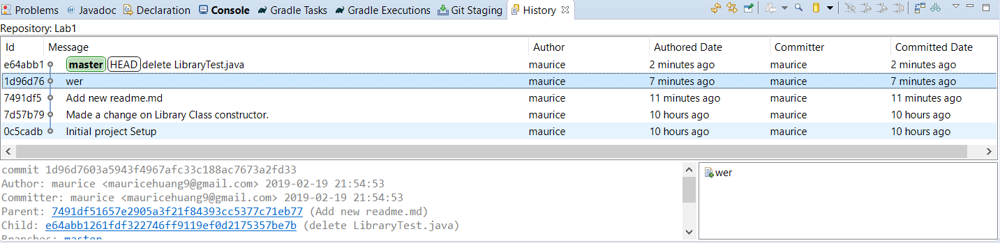

Huang Yi Feng 20470495

Lab3 Git operation:
1. git init

2. git add .
---git commit -m "first commit"
---git add .
---git commit -m "second commit"
---git add .
---git commit -m "third commit"

3. git remote add origin https://github.com/user/repo.git
---git push origin master

4. git checkout 9d665f1

5. git checkout d2c3b5a